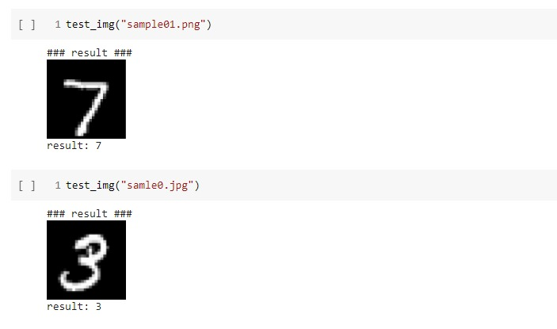

# mnist-Challenge


- Download the [[Data set](http://yann.lecun.com/exdb/mnist/)] using wget tool.
 ```
  wget http://yann.lecun.com/exdb/mnist/train-images-idx3-ubyte.gz
  wget http://yann.lecun.com/exdb/mnist/train-labels-idx1-ubyte.gz
  wget http://yann.lecun.com/exdb/mnist/t10k-images-idx3-ubyte.gz
  wget http://yann.lecun.com/exdb/mnist/t10k-labels-idx1-ubyte.gz
 ```
- Load data and decompress it into files that can be Like "Data.npz".
- get the appropriate divisions:
      ```
      trainX, trainY, testX, testY
      ```
      
- View some data samples using matplotlib library.
Do some preliminary processing on the data, such as:

--re-sizing images into ``` 28*28 ```
--reshape into a single with  1 channel
--Convert  training data from integer to float format
--normalize to range 0-1


- Convert Data Labels to  one hot encode target values ``` to_categorical ``` .
- Create simple cnn model which contains many ```layers(Conv2D, Pool ,Dense)``` as well as input and output layers.
- Use relu activation function and softmax activation function for output layer.
- set learning rate to 0.01.
- Initiate loss function (cross-entropy).
- Finally train the model with training data using fit function.
- Save model to ```"final_model.h5"``` .
- Test the model accuracy with testing data using evaluate function.
  ``` accuracy: 99.15 ```
- The user can test the model and add an image to be classified using load_image function which will process the loaded image then pass it to the trained model to be classified  using predict_classes function  in test_image function.
 ``` test_img("sample01.png")  ```
- show the loaded image and print predicted value.

# result 
  

# install Lib

```
 pip install -U numpy
 pip install -U tensorflow
 pip install -U keras
 pip install matplotlib==3.2.2
```

**Done..**
